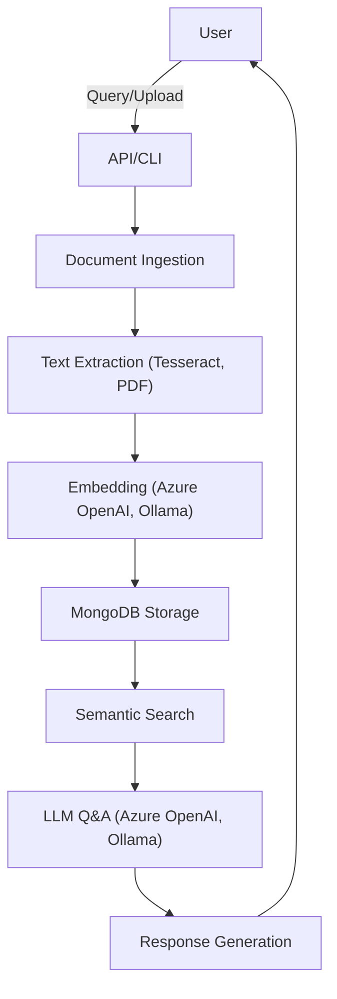
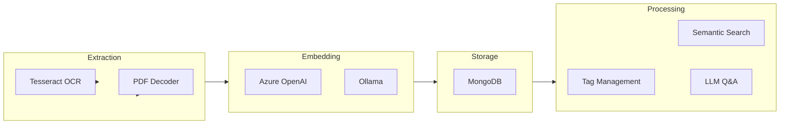
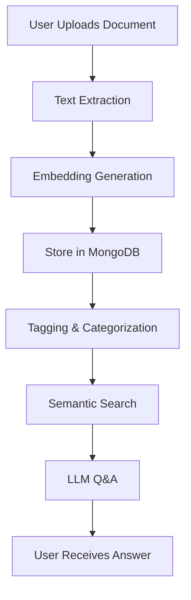
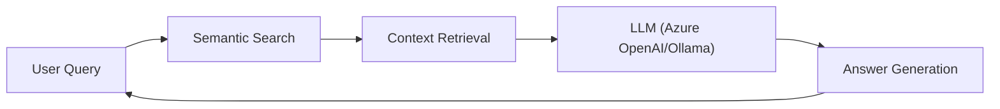

# localRAG

localRAG is a modular, extensible Retrieval-Augmented Generation (RAG) system designed for local and hybrid document processing, semantic search, and AI-powered Q&A. It integrates Azure OpenAI, Ollama, MongoDB, Tesseract OCR, and PDF processing to enable advanced document understanding and conversational AI workflows.

---

**See also:**
- [Solution Overview](solution.md)
- [Solution Flowcharts](solution_flowchart.md)
- [Main Process Flow](Process_main.md)
- [Datasource Maintenance Process](process_datasource_maintenance.md)
- [Tag Generation & Usage](CREATE_TAG.md)

## Project Overview

localRAG ingests documents, extracts and indexes their content, and enables users to query and interact with the knowledge base using state-of-the-art LLMs. The system supports tagging, categorization, and long-term memory, making it suitable for personal, research, or enterprise use.

---

## Technology Stack

- **.NET 8/9** (C#)
- **Azure OpenAI** (gpt-4o-mini, gpt-35-turbo, text-embedding-3-small)
- **Ollama** (local LLMs: deepseek-r1, nomic-embed-text)
- **MongoDB** (document storage, metadata, tags)
- **Tesseract OCR** (image and PDF text extraction)
- **PDF Processing** (iText, OpenXML, ClosedXML)
- **Azure SDKs** (Form Recognizer, Search, Storage)
- **Mermaid** (visualization)

---

## High-Level Architecture



---

## Main Components



---

## Example Data Flow



---

## Features

- **Document Ingestion**: Import PDFs, images, and text files.
- **Text Extraction**: OCR and PDF parsing for content extraction.
- **Semantic Embedding**: Uses Azure OpenAI and Ollama for vectorization.
- **Tagging & Categorization**: Assigns tags and categories to documents.
- **Long-Term Memory**: Stores and retrieves chat and document history.
- **Semantic Search**: Fast, context-aware search over indexed content.
- **Conversational Q&A**: LLM-powered answers with context and citations.
- **Extensible Pipeline**: Plugin-based architecture for custom steps.

---

## Example Flowchart: User Query



---

## Getting Started

### Requirements
- [.NET 8 or 9 SDK](https://dotnet.microsoft.com/en-us/download)
- [Docker & Docker Compose](https://docs.docker.com/get-docker/)
- (Optional) Azure account for Azure OpenAI and Cognitive Search
- (Optional) Ollama for local LLMs

### Start MongoDB with Docker Compose

MongoDB is required for persistent storage. You can start it using the provided `docker-compose.yml`:

```sh
# From the project root
# This will start MongoDB in the background
docker compose -f localRAG/docker-compose.yml up -d
```

You can check the status with:
```sh
docker compose -f localRAG/docker-compose.yml ps
```

### Application Setup

1. **Clone the repository**
2. **Configure environment variables** in `.env` (see sample in repo)
3. **Build the solution**:
   ```sh
   dotnet build localRAG.sln
   ```
4. **Run the application**:
   ```sh
   dotnet run --project localRAG/localRAG.csproj
   ```

---

## Configuration

- All credentials and endpoints are managed via the `.env` file.
- Supports both Azure and local LLMs (Ollama).
- MongoDB is used for persistent storage.

---

## Tagging & Intent Mapping

- If `tags.json` is missing, the system will generate it automatically at startup by processing all uploaded documents.
- Tags are extracted from document content, and for each tag, a set of related user questions/intents is generated.
- Duplicate questions within each tag are removed automatically.
- Tags are used as key-value pairs for document categorization and intent-driven retrieval in the RAG workflow.
- If no documents are present, the system will prompt for uploads before proceeding with tag generation.

See `CREATE_TAG.md` for more details on the tag generation process and the structure of `tags.json`.

---

## Extending localRAG

- Add new document types by extending the extraction pipeline.
- Integrate new LLMs or embedding models via plugin interfaces.
- Customize tagging, search, or Q&A logic in the respective handlers.

---

## License

MIT License
