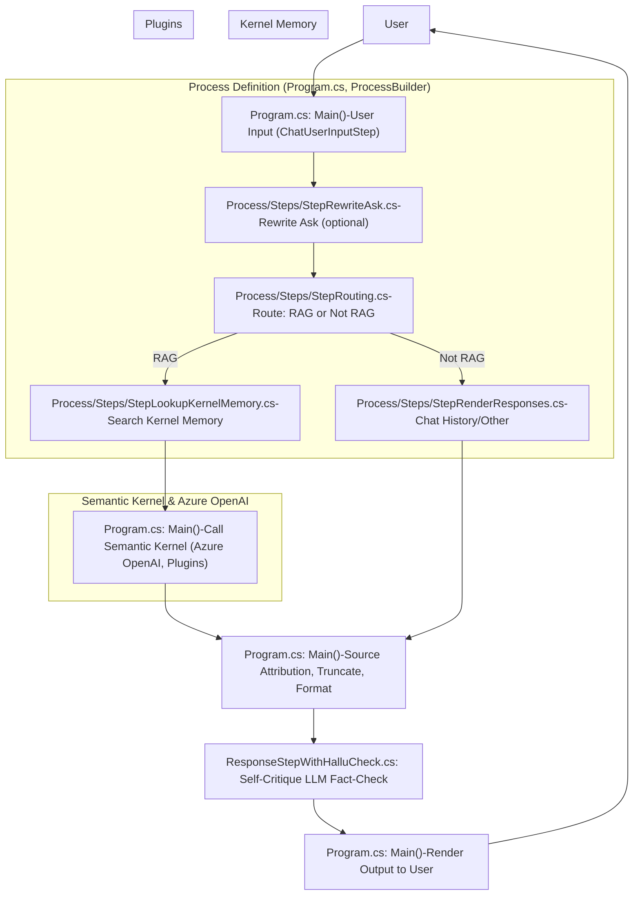
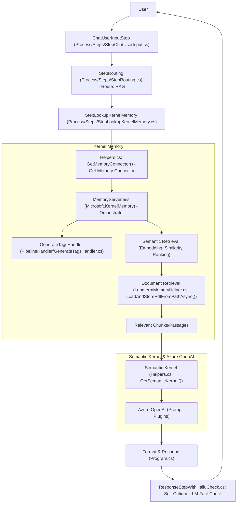

# Solution Flowchart: Main Use Case – User Asks a Question

**Related documentation:**

- [README](README.md)
- [Solution Overview](solution.md)
- [Main Process Flow](Process_main.md)
- [Datasource Maintenance Process](process_datasource_maintenance.md)
- [Tag Generation & Usage](CREATE_TAG.md)

Below is a flowchart (in Mermaid syntax) that illustrates the main use case: a user asks a question and the system processes it using the integrated technologies and modules. The process definition (containing the user input step and sub-steps) is shown as a side flow for clarity. Each step is annotated with the relevant filename and, where useful, the class or method responsible for that part of the flow.

---

---

## Flowchart Explanation (with File References)

- **User** — Initiates the process by asking a question.
- **Program.cs: Main() / ChatUserInputStep** — Receives user input and starts the process.
- **Process/Steps/StepRewriteAsk.cs** — Optionally rewrites the user's question for clarity or intent.
- **Process/Steps/StepRouting.cs** — Determines if the question should be answered using RAG (document retrieval) or not.
- **Process/Steps/StepLookupKernelMemory.cs** — If RAG, searches Kernel Memory for relevant information.
- **Process/Steps/StepRenderResponses.cs** — If not RAG, fetches from chat history or other sources.
- **Program.cs: Main()** — Calls Semantic Kernel, Azure OpenAI, and plugins to generate the answer.
- **ResponseStepWithHalluCheck.cs: Self-Critique LLM Fact-Check** — If no context is found, the answer is fact-checked by the LLM itself and a warning is added if needed.
- **Program.cs: Main()** — Formats the answer, adds source attribution, truncates if needed.
- **Program.cs: Main()** — Renders the output back to the user.
- **Process Definition (Program.cs, ProcessBuilder)** — The process, including user input and sub-steps, is defined and orchestrated in `Program.cs` using `ProcessBuilder` and step classes in `Process/Steps/`.

This flowchart now includes the self-critique step for answers without context, clarifying how the system checks for hallucinations before rendering the response.

# Kernel Memory Call Flowchart: Answering a User Question

Below is a Mermaid flowchart detailing the path and internal steps when the system calls Kernel Memory to answer a user question (RAG path). This chart shows the main modules, methods, and data flow involved in searching, retrieving, and using document knowledge to generate an answer.

---

---

## Chart Explanation (with File References)

- **User** — Asks a question.
- **ChatUserInputStep** — Receives input and triggers the process.
- **StepRouting** — Determines RAG path.
- **StepLookupKernelMemory** — Initiates the search in Kernel Memory.
- **Helpers.cs: GetMemoryConnector()** — Provides the memory connector instance.
- **MemoryServerless: Orchestrator** — Orchestrates memory operations, handlers, and search.
- **GenerateTagsHandler** — Handles tag-based logic and enrichment.
- **Semantic Retrieval** — Embedding, similarity search, and ranking.
- **Document Retrieval** — Loads and parses documents, extracts relevant chunks.
- **Relevant Chunks/Passages** — The most relevant document sections for the query.
- **Semantic Kernel** — Orchestrates prompt execution, plugins, and context assembly.
- **Azure OpenAI** — Generates the final answer using the retrieved context.
- **Format & Respond** — Formats the answer and returns it to the user.
- **ResponseStepWithHalluCheck.cs: Self-Critique LLM Fact-Check** — If no context is found, the answer is fact-checked by the LLM itself and a warning is added if needed.

This chart details the RAG (Kernel Memory) path, showing how a user question is processed, how relevant knowledge is retrieved, and how the answer is generated and returned, including the new hallucination check step.
